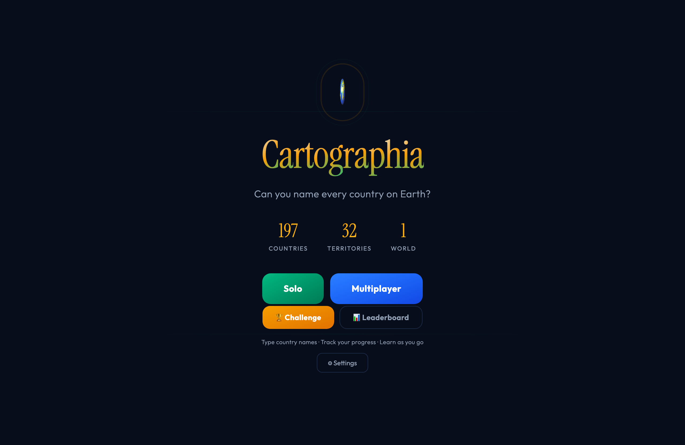

# Cartographia

A browser geography game: **can you name every country on Earth?** Type country
names against a live world map, track your progress across 197 countries and 32
territories, and race the clock in challenge mode — solo or head-to-head in
real-time multiplayer.



## Highlights

- **Interactive world map** rendered with **D3** on real GeoJSON map data — type a
  country and watch it fill in on the map.
- **Solo, Challenge, and Multiplayer** modes, with a leaderboard.
- **Real-time multiplayer** and progress tracking backed by **Firebase**.
- Fuzzy name matching so spelling variants and alternate names still count.

## Tech

React · TypeScript · Vite · D3 · Firebase · Tailwind CSS

## Run it

Requires Node 18+.

```bash
npm install
npm run dev      # start the dev server, open the printed localhost URL
npm run build    # production build
npm run preview  # serve the production build locally
```

## Status

In active development — core gameplay, scoring, and the multiplayer loop are
working; content and polish ongoing.
